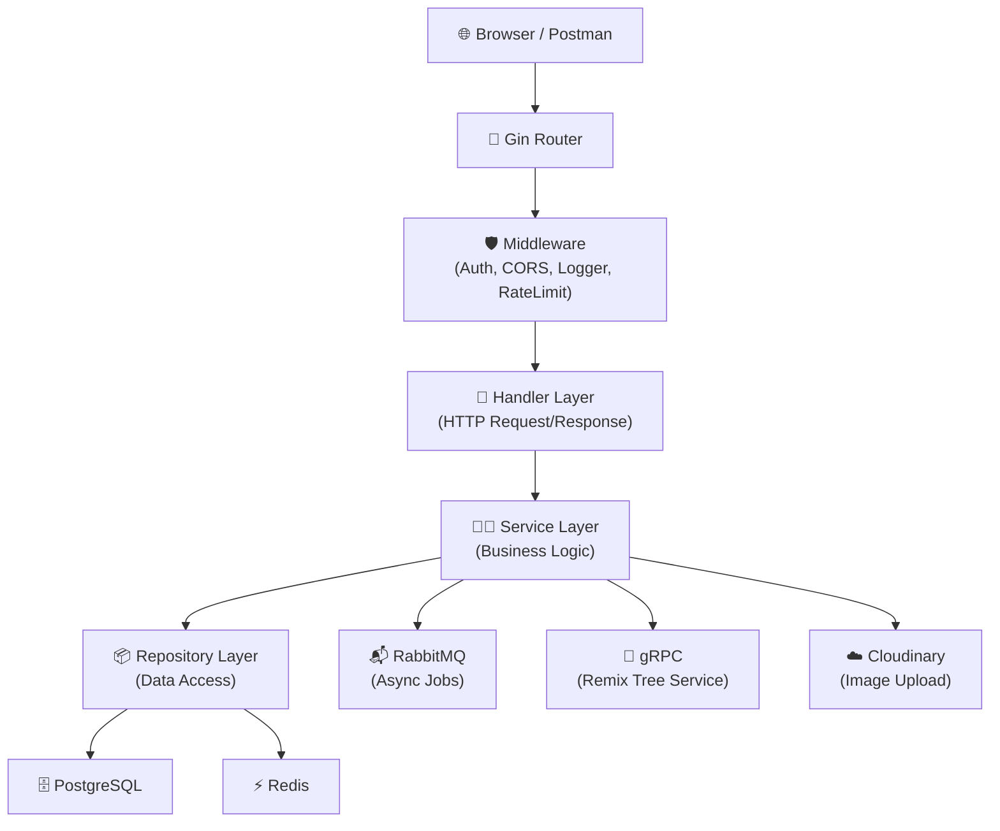
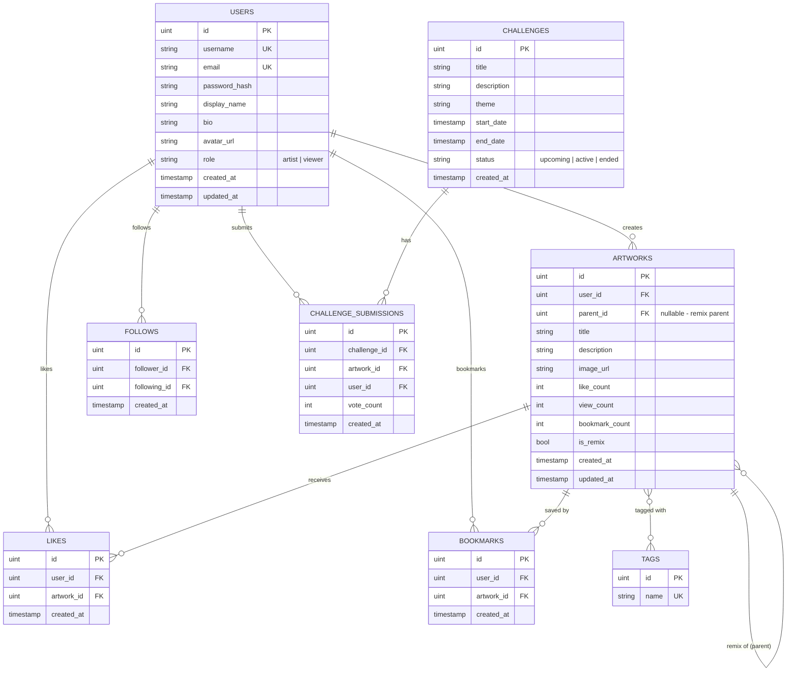

# 🎨 NijiArt — Project Kickoff Document

> **"Your Art, Your World"** — Platform sharing fan art anime yang terinspirasi Pixiv, tapi lebih baik dan unik.

---

## 📋 Phase 1: Planning

### Project Overview
| Item | Detail |
|---|---|
| **Project Name** | NijiArt |
| **Type** | Full-stack Web Application |
| **Developer** | Sandi (Backend) + AI (Frontend) |
| **Timeline** | Sesi 7–17 (masing-masing 1 teknologi) |
| **Target User** | Artist (upload karya) & Viewer (browse, like, follow) |

### Core Features (MVP)
- [x] User registration & authentication (Artist / Viewer)
- [x] Upload artwork dengan metadata (title, description, tags)
- [x] Browse & search artwork (by tag, by artist, trending)
- [x] Like, bookmark, dan follow system
- [x] Artist profile page dengan portfolio
- [x] Pagination & sorting

### Unique Features (Differentiator)
- [x] 🎯 **Art Challenge** — Kontes mingguan dengan leaderboard real-time
- [x] 🔗 **Remix Tree** — Visual rantai inspirasi karya turunan

### Out of Scope (v2 Backlog)
- [ ] Komisi System (marketplace jasa gambar)
- [ ] Ephemeral Exhibition (pameran sementara)
- [ ] Color Palette Extraction (search by color)

---

## 🔍 Phase 2: Analysis — Tech Stack

### Backend (Sandi Bangun Sendiri)
| Layer | Technology | Alasan |
|---|---|---|
| Language | Go 1.21+ | Performa tinggi, concurrency native, cocok untuk backend |
| Framework | Gin | Lightweight, battle-tested, middleware ecosystem |
| ORM | GORM | Relasi kompleks, migration, preloading |
| Database | PostgreSQL | Relational DB terbaik untuk data terstruktur |
| Cache | Redis | Leaderboard, trending, session, TTL |
| Auth | JWT (golang-jwt/jwt/v5) + Bcrypt | Stateless authentication industri standar |
| Real-time | gorilla/websocket | Notifikasi & live vote |
| Message Queue | RabbitMQ | Async processing (notif, cleanup) |
| Microservice | gRPC + Protobuf | Internal Remix Tree service |
| File Storage | Cloudinary | CDN untuk gambar artwork |
| API Docs | Swagger (swaggo/swag) | Auto-generated API documentation |
| Testing | testify + mockery | Unit test + mocking |
| Linter | golangci-lint | Jaga kualitas kode |
| Migration | golang-migrate | Database versioning profesional |

### Frontend (AI Build)
| Technology | Alasan |
|---|---|
| Vite + React | Build tool tercepat + library UI terpopuler |
| TailwindCSS | Utility-first CSS, rapid development |
| Framer Motion | Animasi smooth tanpa berat |

### Infrastructure
| Technology | Alasan |
|---|---|
| Docker & Docker Compose | Containerize semua services |
| GitHub Actions | CI/CD pipeline |
| Render | Deploy Go API |
| Supabase | Managed PostgreSQL |
| Cloudinary | CDN gambar |
| Vercel | Deploy Frontend |

---

## ✏️ Phase 3: Design

### Architecture Diagram



### Database Schema (ERD)



### API Endpoints (Initial Design)

#### Auth
| Method | Endpoint | Description |
|--------|----------|-------------|
| POST | `/api/v1/auth/register` | Register user baru |
| POST | `/api/v1/auth/login` | Login, return JWT |
| GET | `/api/v1/auth/me` | Get current user profile |

#### Users
| Method | Endpoint | Description |
|--------|----------|-------------|
| GET | `/api/v1/users/:username` | Get user profile |
| PUT | `/api/v1/users/:username` | Update profile (protected) |
| POST | `/api/v1/users/:username/follow` | Follow user (protected) |
| DELETE | `/api/v1/users/:username/follow` | Unfollow user (protected) |
| GET | `/api/v1/users/:username/artworks` | Get user's artworks |
| GET | `/api/v1/users/:username/followers` | Get followers list |
| GET | `/api/v1/users/:username/following` | Get following list |

#### Artworks
| Method | Endpoint | Description |
|--------|----------|-------------|
| GET | `/api/v1/artworks` | List artworks (paginated, filterable) |
| POST | `/api/v1/artworks` | Upload artwork (protected) |
| GET | `/api/v1/artworks/:id` | Get artwork detail |
| PUT | `/api/v1/artworks/:id` | Update artwork (protected, owner only) |
| DELETE | `/api/v1/artworks/:id` | Delete artwork (protected, owner only) |
| POST | `/api/v1/artworks/:id/like` | Like artwork (protected) |
| DELETE | `/api/v1/artworks/:id/like` | Unlike artwork (protected) |
| POST | `/api/v1/artworks/:id/bookmark` | Bookmark artwork (protected) |
| DELETE | `/api/v1/artworks/:id/bookmark` | Unbookmark artwork (protected) |
| GET | `/api/v1/artworks/:id/remixes` | Get remix tree |
| POST | `/api/v1/artworks/:id/remix` | Create remix (protected) |

#### Tags
| Method | Endpoint | Description |
|--------|----------|-------------|
| GET | `/api/v1/tags` | List popular tags |
| GET | `/api/v1/tags/:name/artworks` | Get artworks by tag |

#### Challenges (Art Challenge)
| Method | Endpoint | Description |
|--------|----------|-------------|
| GET | `/api/v1/challenges` | List challenges |
| GET | `/api/v1/challenges/:id` | Get challenge detail |
| POST | `/api/v1/challenges/:id/submit` | Submit artwork to challenge (protected) |
| POST | `/api/v1/challenges/:id/vote/:submission_id` | Vote for submission (protected) |
| GET | `/api/v1/challenges/:id/leaderboard` | Get leaderboard |

#### Feed & Discovery
| Method | Endpoint | Description |
|--------|----------|-------------|
| GET | `/api/v1/feed` | Personalized feed (protected) |
| GET | `/api/v1/trending` | Trending artworks |
| GET | `/api/v1/search?q=...` | Search artworks/users/tags |

### Folder Structure (Enterprise-Grade)

```
09-sesi7-relations/
├── cmd/
│   └── api/
│       └── main.go              ← Entry point
├── internal/
│   ├── models/                  ← Database models (GORM structs)
│   │   ├── user.go
│   │   ├── artwork.go
│   │   ├── tag.go
│   │   ├── like.go
│   │   ├── bookmark.go
│   │   ├── follow.go
│   │   ├── challenge.go
│   │   └── challenge_submission.go
│   ├── repository/              ← Data access layer
│   │   ├── user_repo.go
│   │   ├── artwork_repo.go
│   │   └── tag_repo.go
│   ├── service/                 ← Business logic
│   │   ├── user_service.go
│   │   ├── artwork_service.go
│   │   └── tag_service.go
│   └── handler/                 ← HTTP handlers
│       ├── user_handler.go
│       ├── artwork_handler.go
│       └── tag_handler.go
├── config/
│   ├── config.go                ← Load .env
│   └── database.go              ← DB connection
├── pkg/
│   └── response/
│       └── response.go          ← Standar API response format
├── migrations/                  ← SQL migration files (golang-migrate)
├── docs/                        ← Swagger generated docs
├── Makefile                     ← Automation commands
├── Dockerfile                   ← Container build
├── docker-compose.yml           ← Multi-service orchestration
├── .env                         ← Environment variables (gitignored)
├── .env.example                 ← Template env
├── .gitignore
├── .golangci.yml                ← Linter config
├── README.md                    ← Project documentation
└── go.mod
```

---

## 🔨 Phase 4: Implementation — Sesi 7-17 Roadmap

### Sesi 7 Scope (Current)
> **Goal**: Setup project + Database models + Relations + Pagination

- [ ] Init Go module (`nijiart`)
- [ ] Setup folder structure enterprise
- [ ] Setup Git Flow (main → develop → feature/*)
- [ ] Create Makefile
- [ ] Setup golangci-lint
- [ ] Create models: User, Artwork, Tag (with GORM relations)
- [ ] Create models: Like, Bookmark, Follow (junction tables)
- [ ] Repository layer with Preloading
- [ ] Pagination helper (`?page=1&limit=20`)
- [ ] Seed data untuk testing

---

## 🔎 Phase 5: Testing Strategy
- Unit test setiap Service layer (dimulai Sesi 10)
- Mocking Repository dengan testify/mock
- Integration test endpoint dengan httptest
- Target coverage: minimal 70%

## 🚀 Phase 6: Deployment Plan
- Dockerize semua services (Sesi 13)
- CI/CD via GitHub Actions (Sesi 14)
- Deploy: Render (API) + Supabase (DB) + Cloudinary (Images) + Vercel (Frontend)

## 🔧 Phase 7: Maintenance
- v2 features dari backlog
- Performance monitoring
- Bug tracking

---

## 🛠️ Professional Practices (Berlaku Sepanjang Project)

### Git Workflow
- **Branch**: `main` (production), `develop` (staging), `feature/*` (per fitur)
- **Commit**: Conventional Commits (`feat:`, `fix:`, `docs:`, `refactor:`, `test:`)
- **PR**: Setiap feature branch di-merge ke develop via Pull Request

### Code Quality
- `golangci-lint` wajib pass sebelum commit
- Naming convention Go (camelCase internal, PascalCase exported)
- Setiap handler HARUS ada error handling lengkap
- Standar API response format (konsisten)

### API Response Standard
```json
{
    "status": "success",
    "message": "Artworks fetched successfully",
    "data": [...],
    "meta": {
        "page": 1,
        "limit": 20,
        "total": 150,
        "total_pages": 8
    }
}
```

### Error Response Standard
```json
{
    "status": "error",
    "message": "Artwork not found",
    "error": "record not found"
}
```

---

### 🛡️ Security Checklist (Wajib Diimplementasi)

#### Sudah Ter-cover di Roadmap:
- [ ] **Authentication**: JWT + Bcrypt password hashing (Sesi 8)
- [ ] **Authorization**: Protected routes + owner-only actions (Sesi 8)
- [ ] **Rate Limiting**: Redis-based, per endpoint (Sesi 9)
- [ ] **Input Validation**: `binding:"required"` + ShouldBindJSON (Sesi 7+)
- [x] **CORS**: Whitelist origin tertentu (sudah dari Sesi 4)
- [x] **SQL Injection Prevention**: GORM parameterized queries (otomatis aman)
- [x] **Environment Secrets**: `.env` + `.gitignore` (sudah dari Sesi 5)

#### Tambahan Security Measures:
- [ ] **XSS Prevention**: Sanitize semua user input sebelum simpan ke DB (Sesi 7-8)
- [ ] **File Upload Validation**: Validasi MIME type + file size limit (Sesi 12)
- [ ] **JWT Short-lived Tokens**: Access token 15 menit + refresh token (Sesi 8)
- [ ] **Data Exposure Prevention**: `json:"-"` di field sensitif seperti password_hash (Sesi 7)
- [ ] **IDOR Protection**: Cek ownership di Service layer (Sesi 8)
- [ ] **Security Headers**: X-Frame-Options, CSP, X-Content-Type-Options (Middleware)
- [ ] **Account Lockout**: Lock setelah 5x gagal login (Sesi 9)

> [!IMPORTANT]
> **Sesi 7 dimulai.** Scope: project setup + models + relations + pagination.
> Security measures akan diimplementasi bertahap sesuai sesi masing-masing.
