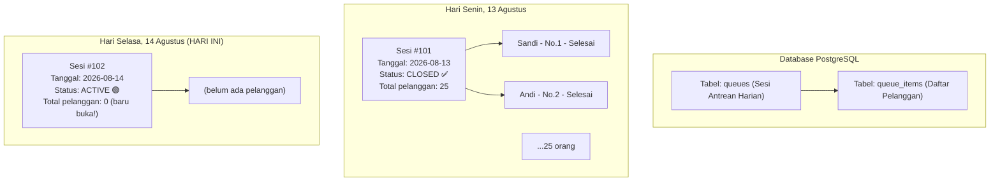

# 🚀 FINAL PROJECT SPESIFIKASI: GoAntri

## 🎯 Visi & Tagline
**"Smart Queue, No More Waiting"**
Sebuah sistem antrean digital (*Smart Queue Management System*) yang menyelesaikan masalah antrean konvensional di Indonesia (Klinik, Barbershop, Bank, dsb).

---

## 👥 Alur Pengguna (User Flow)

### 1. Sisi Pemilik Toko (Membutuhkan Akun & Login)
1. **Daftar & Login:** Menggunakan Email/Password (dilindungi JWT).
2. **Buat Toko:** Mendaftarkan nama toko, alamat, dan jam operasional.
3. **Generate QR Code:** Mendapatkan *link unik* (misal: `goantri.app/q/barbershop-jaya`) dan mencetak QR Code untuk ditempel di pintu toko.
4. **Kelola Antrean:** Membuka dashboard, melihat daftar antrean hari ini, dan menekan tombol **"NEXT"** untuk memanggil pelanggan berikutnya.
5. **Analytics Dashboard:** Melihat data historis seperti total pelanggan per hari, rata-rata waktu layanan, dan jam tersibuk.

### 2. Sisi Pelanggan (Tanpa Akun / Tanpa Login)
1. **Scan QR Code:** Datang ke toko, *scan* QR Code di depan pintu.
2. **Ambil Antrean:** Masukkan nama saja di halaman web yang terbuka.
3. **Halaman Tunggu:** Mendapatkan nomor tiket dan estimasi waktu tunggu.
4. **Live Update:** Halaman web otomatis *update* posisi antrean secara *real-time* tanpa perlu *refresh*.
5. **Giliran Tiba (Digital Buzzer):** Saat giliran tiba, layar HP berubah hijau besar dan berbunyi (Notifikasi). Pelanggan kembali ke toko dan langsung dilayani.

---

## 📐 Arsitektur & Teknologi

**Pembagian Kerja:**
- **Backend (Sandi):** Go + Gin + GORM + PostgreSQL + Redis + WebSocket + JWT
- **Frontend (AI):** Vite + React + TailwindCSS (Dark/Light Mode)
- **Deployment (Bareng):** Render (API) + Supabase (Database) + Vercel (Frontend)

**Fitur & Teknologi yang Diterapkan:**
| Fitur | Teknologi Backend |
|-------|-------------------|
| REST API Design | Gin Framework |
| Relasi Database (Toko, Antrean, Pelanggan) | PostgreSQL + GORM |
| Autentikasi Pemilik | JWT + Bcrypt |
| Caching Data Antrean Aktif | Redis |
| Live Update Posisi Antrean | WebSocket |
| Pencatatan Analytics Latar Belakang | Goroutines |
| Query Dashboard Analytics (AVG, COUNT) | SQL Aggregation |
| Menyatukan Servis (Go, DB, Redis) | Docker Compose |
| Dokumentasi API Standar Industri | Swagger / OpenAPI |

---

## 🔄 Mekanisme Database & Reset Antrean

Antrean tidak di-reset secara paksa. Data lama tidak dihapus, melainkan disimpan sebagai riwayat (History) untuk keperluan *Analytics*.

**Alur Dashboard Pemilik (2 Tampilan Berbeda):**
1. **Tab Antrean Hari Ini (Live):** Menampilkan Sesi yang berstatus `ACTIVE`.
2. **Tab Analytics (Riwayat):** Menampilkan rekap data dari semua Sesi yang berstatus `CLOSED`.

---

## 🔌 Rencana Endpoint API

| Endpoint | Siapa yang Akses | Butuh Auth? |
|----------|:---:|:---:|
| `POST /api/v1/auth/register` | Pemilik | — |
| `POST /api/v1/auth/login` | Pemilik | — |
| `POST /api/v1/stores` | Pemilik | ✅ JWT |
| `GET /api/v1/stores/:id/queue` | Pemilik | ✅ JWT |
| `POST /api/v1/stores/:id/queue/next` | Pemilik | ✅ JWT |
| `GET /api/v1/stores/:id/analytics` | Pemilik | ✅ JWT |
| `POST /api/v1/q/:code/join` | Pelanggan | ❌ (Public) |
| `GET /api/v1/q/:code/status/:ticket` | Pelanggan | ❌ (Public) |
| `WS /api/v1/q/:code/live/:ticket` | Pelanggan | ❌ (Public) |

---
*Dokumen ini adalah "Otak Kedua" Sandi & AI. Jangan dihapus. Akan digunakan sebagai referensi blueprint saat membangun Final Project.*
