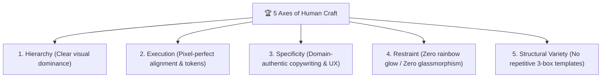

# 🛡️ Anti-AI Slop Engineering & Design Standard (Hallmark & OpenDesign Standard)

When writing backend code, API architecture, frontend components, and UI/UX, **STRICTLY AVOID** low-effort AI signatures and enforce senior human craftsmanship.

---

## 1. 🧹 Code Cleanliness & Zero-Fluff (No Code Slop)

- **NO Obvious/Redundant Comments**:
  - ❌ `// Loop through animes and print: for _, a := range animes { ... }`
  - ❌ `// Function to get user by id: func GetUserByID(id int) { ... }`
  - ✅ Write clean, self-documenting code. Only comment **WHY** a non-obvious business logic decision was made, never restate **WHAT** the code does.
- **NO Over-Engineering & Factory Bloat**:
  - Do not create 5 layers of abstract factories, providers, or premature interfaces for simple tasks.
  - Follow **KISS** (Keep It Simple, Stupid) & **YAGNI** (You Aren't Gonna Need It).
- **NO Silent / Swallowed Errors**:
  - Never do `_ = err` or just `fmt.Println(err)`. Handle errors properly at the source or log with context.
- **Minimal, Surgical Diffs**:
  - Only change what is requested. Never refactor surrounding working code without explicit instruction.

---

## 2. 🎯 Realistic Domain Data (No Lazy Mocks)

- **NO Lazy Test Data**:
  - ❌ `"test1"`, `"foo"`, `"bar"`, `"asdf"`, `"Lorem ipsum dolor sit amet"`
  - ❌ `"User 123"`, `"Sample Description"`, fabricated metrics like *"10,000+ happy users"*
- **YES Realistic Domain Content**:
  - Use real-world, high-context anime & art domain data:
    - Title: *"Sousou no Frieren - Beyond Journey's End"*, Artist: `@kuro_illust`, Tags: `#frieren #illustration #digitalart`
    - Real-world metadata: resolution `3840x2160`, likes count `1,420`, upload timestamps, file formats (PNG/WebP).

---

## 3. 🎨 The 5 Anti-Slop Axes of UI/UX Craftsmanship (Hallmark Standard)

Every UI screen, component, and HTML template must be judged across these 5 fundamental axes:

### 🎯 Axis 1: Hierarchy (Dominansi Visual Jelas)
- Never allow all elements to compete at the same visual weight.
- Strict typographic scale: Category badge (11–12px uppercase) ➡️ Main heading (20–24px bold) ➡️ Lead text (14–15px) ➡️ Helper text (12–13px muted).
- High contrast where it matters: Solid primary CTA vs subtle secondary ghost/outline buttons.

### 🎯 Axis 2: Execution & Alignment (Rata Kiri Alami)
- **BANNED**: The "Centered-Everything Syndrome" (all text, titles, forms, and icons centered on an isolated floating card).
- **STANDARD**: Natural **Left-Aligned** reading flow with proper top navigation, content container, and clean footer framing.
- Use an exact 4px/8px spacing grid (`p-4`, `p-6`, `gap-3`, `gap-6`), never arbitrary magic numbers (`margin-top: 23px`).

### 🎯 Axis 3: Specificity (Bahasa Domain Manusia)
- **BANNED**: AI buzzwords (*"Transform your digital experience with next-gen synergy"*, *"Lumiina Security Shield Pro"*).
- **STANDARD**: Clear, human, functional copy:
  - *"Tautan aktivasi tidak dapat digunakan. Kemungkinan akun Anda sudah aktif pada klik sebelumnya."*
  - *"Unggah karya ilustrasi, kelola bookmark, dan ikuti kreator favoritmu."*

### 🎯 Axis 4: Restraint (Disiplin Warna & Material)
- **BANNED**:
  - ❌ "The Purple Glow Epidemic" (neon purple-to-pink gradients on every button and background).
  - ❌ "Glassmorphism Blur-Soup" (`backdrop-blur-md` cards with opaque borders).
  - ❌ Giant isolated icons floating in pastel circles.
- **STANDARD**:
  - Crisp, clean light theme (Slate/Zinc neutral foundation with **ONE intentional brand accent**, e.g., `#0284c7` Pixiv Blue or `#4f46e5` Indigo).
  - Solid backgrounds with subtle 1px border lines (`border-slate-200`).

### 🎯 Axis 5: Structural Variety (Variasi Makrostruktur)
- **BANNED**: The repetitive "Hero Banner ➡️ 3 Identical Cards with Round Icons ➡️ Floating CTA Box ➡️ Footer".
- **STANDARD**:
  - **Masonry Grid** for organic artwork feeds (Pixiv style).
  - **Master-Detail Split Panels** for artwork viewing + comments.
  - **Bento Grids** and **Asymmetric Cards** for dashboards and feature discovery.

---

## 4. 📋 Pre-Emit Quality Gates (Wajib Lolos Sebelum Kode Selesai)

Sebelum membagikan UI/UX ke user, AI harus memverifikasi 5 gerbang kualitas ini:

1. [ ] **No AI Slop Fingerprints**: Tidak ada gradasi neon ungu, tidak ada efek blur kaca (glassmorphism), tidak ada card melayang terisolasi tanpa navbar/footer.
2. [ ] **State Coverage**: Sudah menangani state *Success*, *Error/Expired*, *Loading*, dan *Empty State*.
3. [ ] **Real Domain Terminology**: Menggunakan istilah platform seni/komunitas nyata (kreator, ilustrasi, tag, bookmark, resolusi).
4. [ ] **Functional Actions**: Tombol memiliki tujuan jelas dan aksi primer/sekunder yang tegas (tidak ada tombol redundan/aneh).
5. [ ] **Responsive & Fixed Dimensions**: Ikon SVG selalu memiliki atribut dimensi pasti (`width="X" height="Y"`) untuk mencegah layout shift.
