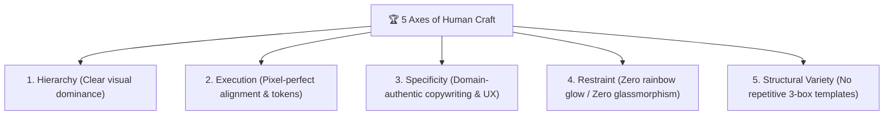

# 🛡️ Anti-AI Slop Engineering & Design Standard (Hallmark & OpenDesign Standard)

When writing backend code, API architecture, frontend components, and UI/UX, **STRICTLY AVOID** low-effort AI signatures and enforce senior human craftsmanship.

---

## 1. 🧹 Code Cleanliness & Zero-Fluff (No Code Slop)

- **NO Obvious/Redundant Comments**:
  - ❌ `// Loop through animes and print: for _, a := range animes { ... }`
  - ❌ `// Function to get user by id: func GetUserByID(id int) { ... }`
  - ✅ Write clean, self-documenting code. Only comment **WHY** a non-obvious business logic decision was made, never restate **WHAT** the code does.
- **NO Over-Engineering & Factory Bloat**:
  - Do not create 5 layers of abstract factories, providers, or premature interfaces for simple tasks.
  - Follow **KISS** (Keep It Simple, Stupid) & **YAGNI** (You Aren't Gonna Need It).
- **NO Silent / Swallowed Errors**:
  - Never do `_ = err` or just `fmt.Println(err)`. Handle errors properly at the source or log with context.
- **Minimal, Surgical Diffs**:
  - Only change what is requested. Never refactor surrounding working code without explicit instruction.

---

## 2. 🎯 Realistic Domain Data (No Lazy Mocks)

- **NO Lazy Test Data**:
  - ❌ `"test1"`, `"foo"`, `"bar"`, `"asdf"`, `"Lorem ipsum dolor sit amet"`
  - ❌ `"User 123"`, `"Sample Description"`, fabricated metrics like *"10,000+ happy users"*
- **YES Realistic Domain Content**:
  - Use real-world, high-context anime & art domain data:
    - Title: *"Sousou no Frieren - Beyond Journey's End"*, Artist: `@kuro_illust`, Tags: `#frieren #illustration #digitalart`
    - Real-world metadata: resolution `3840x2160`, likes count `1,420`, upload timestamps, file formats (PNG/WebP).

---

## 3. 🎨 The 5 Anti-Slop Axes of UI/UX Craftsmanship (Hallmark Standard)

Every UI screen, component, and HTML template must be judged across these 5 fundamental axes:

### 🎯 Axis 1: Hierarchy (Dominansi Visual Jelas)
- Never allow all elements to compete at the same visual weight.
- Strict typographic scale: Category badge (11–12px uppercase) ➡️ Main heading (20–24px bold) ➡️ Lead text (14–15px) ➡️ Helper text (12–13px muted).
- High contrast where it matters: Solid primary CTA vs subtle secondary ghost/outline buttons.

### 🎯 Axis 2: Execution & Alignment (Rata Kiri Alami)
- **BANNED**: The "Centered-Everything Syndrome" (all text, titles, forms, and icons centered on an isolated floating card).
- **STANDARD**: Natural **Left-Aligned** reading flow with proper top navigation, content container, and clean footer framing.
- Use an exact 4px/8px spacing grid (`p-4`, `p-6`, `gap-3`, `gap-6`), never arbitrary magic numbers (`margin-top: 23px`).

### 🎯 Axis 3: Specificity (Bahasa Domain Manusia)
- **BANNED**: AI buzzwords (*"Transform your digital experience with next-gen synergy"*, *"Lumiina Security Shield Pro"*).
- **STANDARD**: Clear, human, functional copy:
  - *"Tautan aktivasi tidak dapat digunakan. Kemungkinan akun Anda sudah aktif pada klik sebelumnya."*
  - *"Unggah karya ilustrasi, kelola bookmark, dan ikuti kreator favoritmu."*

### 🎯 Axis 4: Restraint (Disiplin Warna & Material)
- **BANNED**:
  - ❌ "The Purple Glow Epidemic" (neon purple-to-pink gradients on every button and background).
  - ❌ "Glassmorphism Blur-Soup" (`backdrop-blur-md` cards with opaque borders).
  - ❌ Giant isolated icons floating in pastel circles.
- **STANDARD**:
  - Crisp, clean light theme (Slate/Zinc neutral foundation with **ONE intentional brand accent**, e.g., `#0284c7` Pixiv Blue or `#4f46e5` Indigo).
  - Solid backgrounds with subtle 1px border lines (`border-slate-200`).

### 🎯 Axis 6: Content-First Typography ("Artwork is the Hero")
- **BANNED**:
  - ❌ Overly wide, playful, or quirky geometric sans (like Plus Jakarta Sans) for art gallery feeds that distract from creator illustrations.
- **STANDARD**:
  - Clean, neutral, high x-height typography (**Inter**) as the primary interface font.
  - Native CJK font stack fallbacks (`Hiragino Sans`, `Yu Gothic UI`, `Meiryo`, `system-ui`) so Japanese, Kanji, and anime titles render crisp and authentic.

### 🎯 Axis 7: Responsive Brand Identity ("No Shrunk Wordmarks")
- **BANNED**:
  - ❌ Squeezing a horizontal logo wordmark into a 32px navbar slot until its text becomes illegible and blurry.
  - ❌ Adding cheap hover zoom transforms on brand logos (`hover:scale-105` on navbar brand).
- **STANDARD**:
  - Use a high-resolution, dedicated single-letter icon (`L`) alongside crisp text typography, or maintain proper fixed height without distortion.
  - Keep logo interactions static or subtle color transitions without bouncing.

### 🎯 Axis 8: Mobile & Touch Ergonomics ("No Desktop-Only Thinking")
- **BANNED**:
  - ❌ "The Mobile Hover Trap": hiding critical interactive controls strictly behind `group-hover:opacity-100` with 0% opacity default on touch devices where hover is impossible.
  - ❌ Static `100vh` on mobile image stages, which calculates height ignoring the mobile browser address bar, resulting in clipped controls or jarring layout jumps (CLS).
  - ❌ Squeezing all navigation into a cramped top mobile navbar that cannot be reached with one thumb.
- **STANDARD**:
  - Use dynamic viewport units (`dvh` and `svh`) with safe minimum heights (`min-h-[260px] sm:min-h-[420px]`).
  - Mobile bottom navigation bar (< 768px) within natural thumb-reach with hardware safe area insets (`env(safe-area-inset-bottom)`).
  - Responsive bottom clearance padding (`pb-24 md:pb-8`) on parent layout containers so fixed bottom navigation never masks content.

---

## 4. 🔄 Reactive State Synchronization Standards
- **Server as Absolute Truth**: Never let frontend optimistic updates permanently discard authoritative backend API payloads (`if (!prev[id])` anti-pattern).
- **Graceful Logout Cleanup**: Always scrub user-specific engagement state (likes, bookmarks) upon logout while preserving aggregate community metrics.
- **Defensive Error Extraction**: When handling RFC 7807 JSON error responses (`{error: {code, message}}`), always sanitize payloads to string before passing to React JSX.
- **Numeric ID Normalization**: Always cast URL params and API identifiers to consistent numeric types (`Number(id)`) to eliminate string/integer dictionary key mismatch.

---

## 5. 📋 Pre-Emit Quality Gates (Wajib Lolos Sebelum Kode Selesai)

Sebelum membagikan UI/UX ke user, AI harus memverifikasi gerbang kualitas ini:

1. [ ] **No AI Slop Fingerprints**: Tidak ada gradasi neon ungu, tidak ada efek blur kaca (glassmorphism), tidak ada card melayang terisolasi tanpa navbar/footer.
2. [ ] **Content-First Typography**: Menggunakan font netral (*Inter*) dengan CJK system fallback, bukan display font yang mendominasi artwork.
3. [ ] **No Shrunk Wordmarks**: Logo proporsional, tajam, dan tidak terdistorsi/terlalu kecil di bar navigasi.
4. [ ] **State Coverage**: Sudah menangani state *Success*, *Error/Expired*, *Loading*, dan *Empty State*.
5. [ ] **State Sync & Revert**: Fitur interaksi (Like, Bookmark) mendukung optimistic update + server sync + revert rollback saat network error.
6. [ ] **Real Domain Terminology**: Menggunakan istilah platform seni/komunitas nyata (kreator, ilustrasi, tag, bookmark, resolusi).
7. [ ] **Functional Actions**: Tombol memiliki tujuan jelas dan aksi primer/sekunder yang tegas (tidak ada tombol redundan/aneh).
8. [ ] **Responsive & Fixed Dimensions**: Ikon SVG selalu memiliki atribut dimensi pasti (`width="X" height="Y"`) untuk mencegah layout shift.
9. [ ] **Mobile Ergonomics & DVH**: Kanvas dan modal menggunakan `dvh`/`svh` (bukan static `vh`), aksi penting tidak tersembunyi di balik hover-only pada layar sentuh, dan memiliki safe-area insets serta clearance padding (`pb-24 md:pb-8`).
