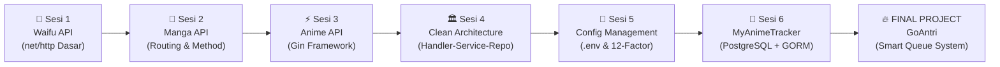
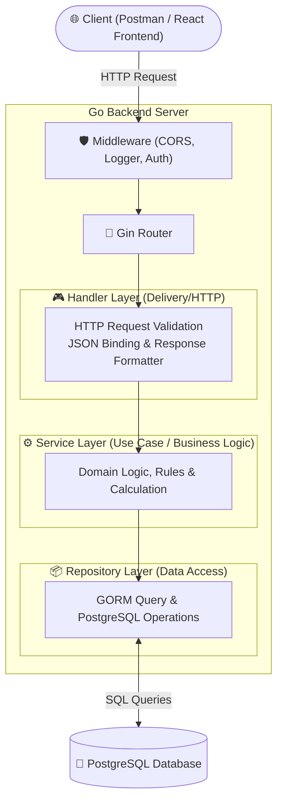

# 🚀 Go Backend Engineering Journey
### *From Fundamentals to Production-Grade Distributed Systems*

  <b>Repository perjalanan belajar intensif menuju Senior Go Backend Engineer.</b> 
  Fokus pada <i>Clean Architecture</i>, <i>Database Design</i>, <i>Security Mindset</i>, dan <i>Production-Ready APIs</i>.

---

## 🗺️ Roadmap & Modul Pembelajaran

| Modul | Project | Fokus & Konsep Utama | Status |
| :--- | :--- | :--- | :---: |
| **01** | `03-sesi1-waifu` | `net/http` standard library, handler signature, JSON serialization | ✅ Selesai |
| **02** | `04-sesi2-manga` | RESTful routing, URL prefix parsing, in-memory slice manipulation | ✅ Selesai |
| **03** | `05-sesi3-gin` | Gin Engine, route grouping, `c.ShouldBindJSON`, middleware | ✅ Selesai |
| **04** | `06-sesi4-structure` | Clean Architecture (Handler-Service-Repository), Dependency Injection | ✅ Selesai |
| **05** | `07-sesi5-config` | 12-Factor App, `.env`, fallback defaults, `joho/godotenv` | ✅ Selesai |
| **06** | `08-sesi6-database` | **MyAnimeTracker**: PostgreSQL, GORM, AutoMigrate, Relational CRUD | ⏳ In Progress |
| **07** | *Coming Soon* | JWT Authentication, Bcrypt Password Hashing, Auth Middleware | ⬜ Planned |
| **08** | *Coming Soon* | Redis Caching, WebSocket Real-time notifications | ⬜ Planned |
| **09** | *Coming Soon* | Swagger/OpenAPI Documentation (`swaggo/swag`) | ⬜ Planned |
| **10** | **GoAntri** | **Final Capstone Project**: Smart Queue Management System | 🚀 Planned |

---

## 🏛️ Arsitektur Standar (Handler-Service-Repository)

Setiap modul di repository ini menerapkan pemisahan tanggung jawab (*Separation of Concerns*) berbasis **Clean Architecture**:

---

## 📸 Showcase & Preview

*(Screenshot Postman tests & UI Dashboard akan ditampilkan di sini)*

<b>Lihat Screenshot Dokumentasi Testing API</b>

> *Akan diupdate dengan screenshot Postman & live frontend.*

---

## 🛠️ Tech Stack & Ekosistem

* **Language**: [Go (Golang) v1.21+](https://go.dev/)
* **Web Framework**: [Gin-Gonic](https://github.com/gin-gonic/gin)
* **Database**: [PostgreSQL 16](https://www.postgresql.org/)
* **ORM**: [GORM](https://gorm.io/)
* **Environment**: [Godotenv](https://github.com/joho/godotenv)
* **Containerization**: [Docker & Docker Compose](https://www.docker.com/)
* **Frontend Companion**: [Vite + React + TailwindCSS](https://vitejs.dev/)

---

## 📜 Conventional Commits Standard

Repository ini menerapkan format commit profesional:

* `feat:` Menambahkan fitur atau endpoint baru
* `fix:` Memperbaiki bug atau kesalahan penanganan error
* `refactor:` Restrukturisasi kode tanpa mengubah fungsionalitas
* `docs:` Dokumentasi, roadmap update, atau README
* `chore:` Konfigurasi `.env`, dependency module, atau docker setup

---

  Crafted with passion & senior engineering principles.

