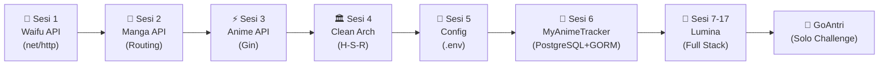

# 🚀 Go Backend Engineering Journey
### *From Fundamentals to Production-Grade Distributed Systems*

  <b>Repository perjalanan belajar intensif menuju Mid-Level Go Backend Engineer.</b> 
  Fokus pada <i>Clean Architecture</i>, <i>Database Design</i>, <i>Security Mindset</i>, dan <i>Production-Ready APIs</i>.

---

## 🗺️ Roadmap & Modul Pembelajaran

> **Prinsip: 1 Sesi = 1 Teknologi = 1 Mini Project Praktik**

### Fase 1: Fondasi (MyAnimeTracker)

| Sesi | Folder | Fokus & Konsep Utama | Status |
| :---: | :--- | :--- | :---: |
| 1 | `03-sesi1-waifu` | `net/http` standard library, handler signature, JSON serialization | ✅ |
| 2 | `04-sesi2-manga` | RESTful routing, URL prefix parsing, in-memory slice manipulation | ✅ |
| 3 | `05-sesi3-gin` | Gin Engine, route grouping, `c.ShouldBindJSON`, middleware | ✅ |
| 4 | `06-sesi4-structure` | Clean Architecture (Handler-Service-Repository), Dependency Injection | ✅ |
| 5 | `07-sesi5-config` | 12-Factor App, `.env`, fallback defaults, `joho/godotenv` | ✅ |
| 6 | `08-sesi6-database` | **MyAnimeTracker**: PostgreSQL, GORM, AutoMigrate, Relational CRUD | ⏳ |

### Fase 2: Lumina 🎨 — Platform Sharing Fan Art Anime

> Terinspirasi Pixiv, tapi redesign yang lebih baik dan unik.
> Setiap sesi menambahkan 1 teknologi baru ke Lumina.

| Sesi | Folder | Teknologi | Fitur Lumina |
| :---: | :--- | :--- | :--- |
| 7 | `lumina/` | Git Flow, Makefile, Linter | Setup standar industri & relasi database |
| 8 | `lumina/` | JWT + Bcrypt | Register/Login artist |
| 9 | `lumina/` | Redis Caching | Cache popular artworks & trending tags |
| 10 | `lumina/` | Unit Test & Mocking | Test Service & Handler Layer |
| 11 | `lumina/` | WebSocket | Real-time notifications (like/follow) |
| 12 | `lumina/` | Goroutines & File Upload | Upload ke Cloudinary + background resize |
| 13 | `lumina/` | Docker & Compose | Containerize seluruh stack |
| 14 | `lumina/` | Swagger & CI/CD Pipeline | API docs & GitHub Actions (Auto test) |
| 15 | `lumina/` | RabbitMQ | Async notification processing |
| 16 | `lumina/` | gRPC | Internal recommendation service |
| 17 | — | Polish & Deploy | Frontend (React) + deploy production |

### 🎯 Tantangan Mandiri: GoAntri — Smart Queue Management

> Project solo untuk membuktikan kemampuan membangun aplikasi lengkap dari nol secara mandiri.
> Dikerjakan setelah semua sesi selesai — ujian sejati seorang Mid-Level Dev.

---

## 🏛️ Arsitektur Standar (Handler-Service-Repository)

Setiap modul di repository ini menerapkan pemisahan tanggung jawab (*Separation of Concerns*) berbasis **Clean Architecture**:

---

## 📸 Showcase & Preview

*(Screenshot Postman tests & UI Dashboard akan ditampilkan di sini)*

<b>Lihat Screenshot Dokumentasi Testing API</b>

> *Akan diupdate dengan screenshot Postman & live frontend.*

---

## 🛠️ Tech Stack & Ekosistem

| Kategori | Teknologi |
| :--- | :--- |
| **Language** | [Go (Golang) v1.21+](https://go.dev/) |
| **Web Framework** | [Gin-Gonic](https://github.com/gin-gonic/gin) |
| **Database** | [PostgreSQL 16](https://www.postgresql.org/) |
| **ORM** | [GORM](https://gorm.io/) |
| **Cache** | [Redis](https://redis.io/) |
| **Message Queue** | [RabbitMQ](https://www.rabbitmq.com/) |
| **Real-time** | WebSocket ([gorilla/websocket](https://github.com/gorilla/websocket)) |
| **Inter-service** | [gRPC](https://grpc.io/) + Protocol Buffers |
| **Auth** | JWT ([golang-jwt](https://github.com/golang-jwt/jwt)) + Bcrypt |
| **Environment** | [Godotenv](https://github.com/joho/godotenv) |
| **Docs** | [Swagger/OpenAPI](https://github.com/swaggo/swag) |
| **Testing** | Go testing + [Testify](https://github.com/stretchr/testify) |
| **Containerization** | [Docker & Docker Compose](https://www.docker.com/) |
| **Frontend** | [Vite](https://vitejs.dev/) + [React](https://react.dev/) + [TailwindCSS](https://tailwindcss.com/) + [Framer Motion](https://www.framer.com/motion/) |

---

## 📜 Conventional Commits Standard

Repository ini menerapkan format commit profesional:

* `feat:` Menambahkan fitur atau endpoint baru
* `fix:` Memperbaiki bug atau kesalahan penanganan error
* `refactor:` Restrukturisasi kode tanpa mengubah fungsionalitas
* `docs:` Dokumentasi, roadmap update, atau README
* `chore:` Konfigurasi `.env`, dependency module, atau docker setup

---

  Crafted with passion & mid-level engineering principles.

