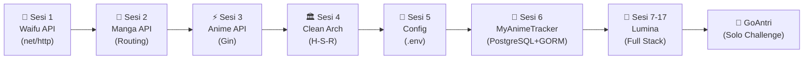

# 🚀 Go Backend Engineering Journey
### *From Fundamentals to Production-Grade Distributed Systems*

  <b>Repository perjalanan belajar intensif menuju Mid-Level Go Backend Engineer.</b> 
  Fokus pada <i>Clean Architecture</i>, <i>Database Design</i>, <i>Security Mindset</i>, dan <i>Production-Ready APIs</i>.

---

## 🗺️ Roadmap & Modul Pembelajaran

> **Prinsip: 1 Sesi = 1 Teknologi = 1 Mini Project Praktik**

### Fase 1: Fondasi (MyAnimeTracker)

| Sesi | Folder | Fokus & Konsep Utama | Status |
| :---: | :--- | :--- | :---: |
| 1 | `03-sesi1-waifu` | `net/http` standard library, handler signature, JSON serialization | ✅ |
| 2 | `04-sesi2-manga` | RESTful routing, URL prefix parsing, in-memory slice manipulation | ✅ |
| 3 | `05-sesi3-gin` | Gin Engine, route grouping, `c.ShouldBindJSON`, middleware | ✅ |
| 4 | `06-sesi4-structure` | Clean Architecture (Handler-Service-Repository), Dependency Injection | ✅ |
| 5 | `07-sesi5-config` | 12-Factor App, `.env`, fallback defaults, `joho/godotenv` | ✅ |
| 6 | `08-sesi6-database` | **MyAnimeTracker**: PostgreSQL, GORM, AutoMigrate, Relational CRUD | ✅ |

### Fase 2: Lumiina 🎨 — Platform Sharing Fan Art Anime (Live Production)

> **Official Flagship Domain**: [https://www.lumiina.art](https://www.lumiina.art) *(Primary, Anycast Vercel Edge)*  
> **Edge Deployment Fallback**: [https://lumiina-art.vercel.app](https://lumiina-art.vercel.app)  
> **Personal Tech Portfolio Domain**: `https://nindhita.xyz` *(Secured via Hostinger DNS)*  
> Terinspirasi Pixiv, dirancang dengan Clean Architecture Go, PostgreSQL (Supabase), Redis (Upstash), dan React SPA.

| Sesi | Folder | Teknologi | Fitur & Arsitektur Lumiina | Status |
| :---: | :--- | :--- | :--- | :---: |
| 7 | `lumiina/` | Git Flow, Makefile, golang-migrate | Setup arsitektur enterprise, relasi DB, dan pagination | ✅ |
| 8 | `lumiina/` | JWT + Bcrypt | Autentikasi multi-identitas & otorisasi RBAC | ✅ |
| 9 | `lumiina/` | Cloudinary v2 SDK + MIME Sniffing | Upload karya seni berkeamanan tinggi & tag management | ✅ |
| 10 | `lumiina/` | Redis Caching + Rate Limiter | Singleflight, atomic rate limit, komentar, dan email auth | ✅ |
| 11 | `lumiina/` | Docker & CI/CD Pipeline | Multi-stage Dockerfile, healthchecks, dan Swagger docs | ✅ |
| 12 | `lumiina/` | Vite + React + TailwindCSS | UI/UX redesign, follow/bookmark system, digital artist studio | ✅ |
| 13 | `lumiina/` | Cloud Deployment (Supabase + Upstash + Vercel) | Production launch, latency tuning, dan multi-region routing | ✅ |
| 14 | `lumiina/` | API Defense-in-Depth (Vectors 1–7) | Metrics lockdown (404/ConstantTime), Release mode, Opaque health probes, Account lockout, Decompression bomb defense, CSP | ✅ |
| 15 | `lumiina/` | Technical SEO Engine & Wave-1 Pre-renderer | Dynamic XML sitemap, Google Image extensions, Redis edge cache, bot prerender middleware, GSC domain verification (`URL is on Google`) | ✅ |
| 16 | `lumiina/` | Official Brand & Character Bible v1.0 | Rebrand maskot tunggal Lumiina, sticker engine (`:lumiina_1:` - `:lumiina_9:`), WebP visual pipeline, human-crafted editorial `/about` | ✅ |

### Fase 3: QA & SDET Engineering Masterclass 🛡️ (Live Automation Suite)

> **Repositori Pengujian Mandiri**: [`qa-journey/`](file:///home/sandi/Documents/Golang_Learn/qa-journey) (`Nyanns/lumiina-qa-automation`)  
> **Standar**: IEEE 829, ISTQB Foundation, OWASP API Security Top 10

| Modul | Fokus Pengujian | Tumpukan Alat & Framework | Status |
| :---: | :--- | :--- | :---: |
| 1 | QA Fundamentals & Test Mindset | STLC, Test Pyramid, 7 Prinsip ISTQB | ✅ |
| 2 | Black Box Test Design Techniques | Equivalence Partitioning (EP), BVA, Decision Table | ✅ |
| 3 | Test Documentation & Matrix | Google Sheets, IEEE 829 Test Matrix (Pass Rate 92.3%) | ✅ |
| 4 | Defect Lifecycle & Bug Tracking | Jira Software (LUM-5), GitHub Issues (#26) | ✅ |
| 5 | API Automation Testing | Postman, Chai JS, Newman CLI, HTML Extra Reporter | 🚀 Siap Masuk |
| 6 | Web UI E2E Automation | Playwright (Chromium/Firefox/WebKit), Page Object Model | ⏳ |
| 7 | Performance & Stress Testing | Grafana k6, Latency SLA Metrics (p95/p99) | ⏳ |
| 8 | QA CI/CD Pipeline | GitHub Actions, Automated Workflow, Artifact Publishing | ⏳ |
| 9 | Portfolio & Interview Mastery | Comprehensive Test Artifacts, Technical Interview Drill | ⏳ |

### 🎯 Tantangan Mandiri: GoAntri — Smart Queue Management

> Project solo untuk membuktikan kemampuan membangun aplikasi lengkap dari nol secara mandiri.
> Dikerjakan setelah seluruh materi selesai — ujian sejati seorang Mid-Level Dev.

---

## 🏛️ Arsitektur Standar (Handler-Service-Repository)

Setiap modul di repository ini menerapkan pemisahan tanggung jawab (*Separation of Concerns*) berbasis **Clean Architecture**:

---

## 📸 Showcase & Preview

*(Screenshot Postman tests & UI Dashboard akan ditampilkan di sini)*

<b>Lihat Screenshot Dokumentasi Testing API</b>

> *Akan diupdate dengan screenshot Postman & live frontend.*

---

## 🛠️ Tech Stack & Ekosistem

| Kategori | Teknologi |
| :--- | :--- |
| **Language** | [Go (Golang) v1.21+](https://go.dev/) |
| **Web Framework** | [Gin-Gonic](https://github.com/gin-gonic/gin) |
| **Database** | [PostgreSQL 16](https://www.postgresql.org/) |
| **ORM** | [GORM](https://gorm.io/) |
| **Cache** | [Redis](https://redis.io/) |
| **Message Queue** | [RabbitMQ](https://www.rabbitmq.com/) |
| **Real-time** | WebSocket ([gorilla/websocket](https://github.com/gorilla/websocket)) |
| **Inter-service** | [gRPC](https://grpc.io/) + Protocol Buffers |
| **Auth** | JWT ([golang-jwt](https://github.com/golang-jwt/jwt)) + Bcrypt |
| **Environment** | [Godotenv](https://github.com/joho/godotenv) |
| **Docs** | [Swagger/OpenAPI](https://github.com/swaggo/swag) |
| **Testing (Unit)** | Go testing + [Testify](https://github.com/stretchr/testify) |
| **API Automation** | [Postman](https://www.postman.com/) + [Newman CLI](https://github.com/postmanlabs/newman) (Chai JS) |
| **Web UI E2E** | [Playwright](https://playwright.dev/) (Page Object Model) |
| **Performance Testing**| [Grafana k6](https://k6.io/) (p95/p99 latency benchmarks) |
| **Defect Tracking** | [Atlassian Jira](https://www.atlassian.com/software/jira) + GitHub Issues |
| **Containerization** | [Docker & Docker Compose](https://www.docker.com/) |
| **Frontend** | [Vite](https://vitejs.dev/) + [React](https://react.dev/) + [TailwindCSS](https://tailwindcss.com/) + [Framer Motion](https://www.framer.com/motion/) |

---

## 📜 Conventional Commits Standard

Repository ini menerapkan format commit profesional:

* `feat:` Menambahkan fitur atau endpoint baru
* `fix:` Memperbaiki bug atau kesalahan penanganan error
* `refactor:` Restrukturisasi kode tanpa mengubah fungsionalitas
* `docs:` Dokumentasi, roadmap update, atau README
* `chore:` Konfigurasi `.env`, dependency module, atau docker setup

---

  Crafted with passion & mid-level engineering principles.

